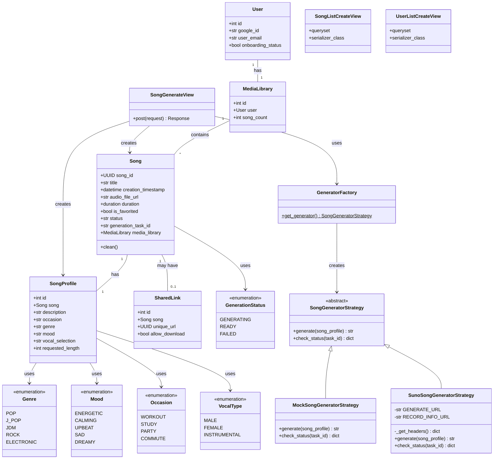
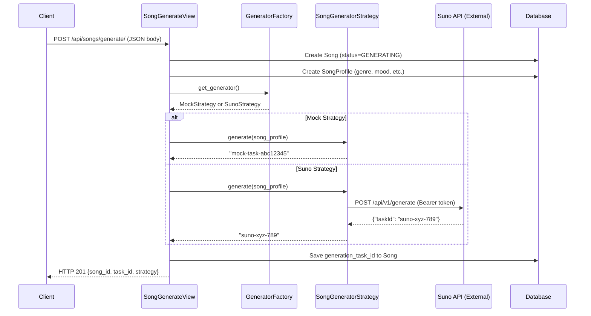

# AiSongGen — AI Song Generator Platform

A Django 4.2 + DRF backend for the AI Song Generator Platform, implementing the Domain Layer and the **Strategy Design Pattern** for interchangeable song generation.

---

## Stack
| Package | Version | Purpose |
|---|---|---|
| Django | ≥ 4.2 | Web framework (MVT) |
| djangorestframework | ≥ 3.14 | REST API |
| django-cors-headers | ≥ 4.3 | CORS for frontend |
| python-decouple | ≥ 3.8 | Externalize secrets |
| django-extensions | ≥ 3.2 | Dev utilities |
| requests | ≥ 2.31 | HTTP client for Suno API |

---

## Installation

```bash
# 1. Clone the repository
git clone https://github.com/SivaponChannual/AiSongGen.git
cd AiSongGen

# 2. Create and activate virtual environment
python3 -m venv venv
source venv/bin/activate   # Windows: venv\Scripts\activate

# 3. Install dependencies
pip install -r requirements.txt

# 4. Create .env file
echo SECRET_KEY=your-secret-key-here > .env
echo DEBUG=True >> .env
echo GENERATOR_STRATEGY=mock >> .env
echo SUNO_API_KEY= >> .env

# 5. Apply migrations
python manage.py migrate

# 6. Create a superuser (for Admin panel)
python manage.py createsuperuser

# 7. Run the development server
python manage.py runserver
```

---

## Project Structure (One Class Per File)

```
AiSongGen/
├── core/                        # Django project configuration
│   ├── settings.py              # python-decouple, CORS, strategy settings
│   ├── urls.py                  # Routes /api/ → generator.api.urls
│   ├── wsgi.py
│   └── asgi.py
├── generator/                   # Main Django application
│   ├── models/                  # Domain Layer (one class per file)
│   │   ├── enums.py             # Genre, Mood, Occasion, VocalType, GenerationStatus
│   │   ├── user.py              # User
│   │   ├── library.py           # MediaLibrary
│   │   ├── song.py              # Song (UUID PK, ±10s clean(), generation_task_id)
│   │   ├── profile.py           # SongProfile
│   │   ├── shared.py            # SharedLink
│   │   └── __init__.py
│   ├── services/                # Strategy Pattern (Exercise 4)
│   │   ├── strategy.py          # SongGeneratorStrategy (abstract interface)
│   │   ├── mock_strategy.py     # MockSongGeneratorStrategy
│   │   ├── suno_strategy.py     # SunoSongGeneratorStrategy
│   │   ├── factory.py           # GeneratorFactory (centralized selection)
│   │   └── __init__.py
│   ├── serializers/             # DRF ModelSerializers
│   │   ├── user_serializer.py   # UserSerializer
│   │   ├── song_serializer.py   # SongSerializer
│   │   └── __init__.py
│   ├── api/                     # Views + URL routing
│   │   ├── views.py             # CRUD views + SongGenerateView
│   │   ├── urls.py
│   │   └── __init__.py
│   └── admin.py                 # All 5 models registered
├── .env                         # Secrets (git-ignored)
├── .gitignore
├── requirements.txt
└── manage.py
```

---

## Class Diagram (MVT Architecture)



---

## Sequence Diagram — Song Generation Use Case



---

## Strategy Pattern (Exercise 4)

### How It Works

The **Strategy Design Pattern** decouples the song generation logic from the rest of the application. Two interchangeable strategies are provided:

| Strategy | Class | Behavior |
|---|---|---|
| **Mock** | `MockSongGeneratorStrategy` | Returns a fake task ID instantly. No network calls. Used for development and testing. |
| **Suno** | `SunoSongGeneratorStrategy` | Calls the real Suno API at `api.sunoapi.org` to generate music. Requires a valid API key. |

### Switching Strategies

Edit your `.env` file:

```bash
# For offline/testing (default):
GENERATOR_STRATEGY=mock

# For real Suno API generation:
GENERATOR_STRATEGY=suno
SUNO_API_KEY=your-suno-api-key-here
```

> **Important:** Never commit your `.env` file or API keys to GitHub. The `.gitignore` already excludes `.env`.

### Strategy Selection Flow

```
.env (GENERATOR_STRATEGY=mock|suno)
    ↓
core/settings.py reads it via python-decouple
    ↓
GeneratorFactory.get_generator() checks the setting
    ↓
Returns MockSongGeneratorStrategy or SunoSongGeneratorStrategy
    ↓
SongGenerateView calls strategy.generate(profile)
```

---

## API Endpoints

### Users (CRUD)

| Method | URL | Action |
|--------|-----|--------|
| `GET` | `/api/users/` | List all users |
| `POST` | `/api/users/` | Create a new user |
| `GET` | `/api/users/<id>/` | Retrieve a user |
| `PUT` | `/api/users/<id>/` | Full update a user |
| `PATCH` | `/api/users/<id>/` | Partial update a user |
| `DELETE` | `/api/users/<id>/` | Delete a user |

### Songs (CRUD)

| Method | URL | Action |
|--------|-----|--------|
| `GET` | `/api/songs/` | List all songs |
| `POST` | `/api/songs/` | Create a new song |
| `GET` | `/api/songs/<uuid>/` | Retrieve a song |
| `PUT` | `/api/songs/<uuid>/` | Full update a song |
| `PATCH` | `/api/songs/<uuid>/` | Partial update a song |
| `DELETE` | `/api/songs/<uuid>/` | Delete song (cascades SharedLink) |

### Song Generation (Strategy Pattern)

| Method | URL | Action |
|--------|-----|--------|
| `POST` | `/api/songs/generate/` | Generate a song using the active strategy |

**Example request:**
```bash
curl -X POST http://127.0.0.1:8000/api/songs/generate/ \
  -H "Content-Type: application/json" \
  -d '{
    "title": "Morning Drive Mix",
    "media_library": 1,
    "occasion": "COMMUTE",
    "genre": "JDM",
    "mood": "ENERGETIC",
    "vocal_selection": "MALE",
    "requested_length": 180
  }'
```

---

## Evidence of CRUD Functionality

All operations were tested against the live local server (`http://127.0.0.1:8000`).

---

### CREATE — `POST /api/users/`

```bash
curl -X POST http://127.0.0.1:8000/api/users/ \
  -H "Content-Type: application/json" \
  -d '{"google_id":"g-demo-001","user_email":"creator@aisonggen.com","onboarding_status":false}'
```

**Response — HTTP 201 Created**
```json
{
    "id": 4,
    "google_id": "g-demo-001",
    "user_email": "creator@aisonggen.com",
    "onboarding_status": false
}
```

---

### READ — `GET /api/users/`

```bash
curl http://127.0.0.1:8000/api/users/
```

**Response — HTTP 200 OK**
```json
[
    {
        "id": 2,
        "google_id": "gg",
        "user_email": "asd@gmail.com",
        "onboarding_status": false
    },
    {
        "id": 3,
        "google_id": "test-g-001",
        "user_email": "testuser@aisonggen.com",
        "onboarding_status": false
    }
]
```

---

### UPDATE — `PATCH /api/users/4/`

```bash
curl -X PATCH http://127.0.0.1:8000/api/users/4/ \
  -H "Content-Type: application/json" \
  -d '{"onboarding_status":true}'
```

**Response — HTTP 200 OK**
```json
{
    "id": 4,
    "google_id": "g-demo-001",
    "user_email": "creator@aisonggen.com",
    "onboarding_status": true
}
```

> `onboarding_status` changed from `false` → `true` ✅

---

### DELETE — `DELETE /api/users/4/`

```bash
curl -X DELETE http://127.0.0.1:8000/api/users/4/
```

**Response — HTTP 204 No Content** ✅

---

### GENERATE — `POST /api/songs/generate/` (Strategy Pattern)

```bash
curl -X POST http://127.0.0.1:8000/api/songs/generate/ \
  -H "Content-Type: application/json" \
  -d '{
    "title": "Test Mock Generation",
    "media_library": 1,
    "occasion": "WORKOUT",
    "genre": "ELECTRONIC",
    "mood": "ENERGETIC",
    "vocal_selection": "MALE",
    "requested_length": 180
  }'
```

**Response — HTTP 201 Created (Mock Strategy)**
```json
{
    "message": "Song generation initiated.",
    "strategy": "MockSongGeneratorStrategy",
    "song_id": "e7db8a5c-ab13-4bfd-a53d-66f6f4b5ffdf",
    "title": "Test Mock Generation",
    "generation_task_id": "mock-task-eb1622f7",
    "status": "GENERATING"
}
```

> The response shows which strategy was used (`MockSongGeneratorStrategy`) and the returned `generation_task_id`.

---

## Domain Model Summary

### Enumerations
| Enum | Values |
|---|---|
| `Genre` | POP, J_POP, JDM, ROCK, ELECTRONIC |
| `Mood` | ENERGETIC, CALMING, UPBEAT, SAD, DREAMY |
| `Occasion` | WORKOUT, STUDY, PARTY, COMMUTE |
| `VocalType` | MALE, FEMALE, INSTRUMENTAL |
| `GenerationStatus` | GENERATING, READY, FAILED |

### Business Rules
- **±10-second variance**: `Song.clean()` raises `ValidationError` if the actual duration deviates more than 10 seconds from `SongProfile.requested_length`.
- **Instant revocation**: Deleting a `Song` cascades to its `SharedLink` via `on_delete=CASCADE`.
- **Title constraint**: `Song.title` — max 256 chars, UTF-8.
- **Ownership isolation**: Every `Song` belongs to exactly one `MediaLibrary`, which belongs to exactly one `User`.

---

## Django Admin

All 5 domain models are manageable via `http://127.0.0.1:8000/admin/`:

| Model | Admin URL |
|---|---|
| Users | `/admin/generator/user/` |
| Media Libraries | `/admin/generator/medialibrary/` |
| Songs | `/admin/generator/song/` |
| Song Profiles | `/admin/generator/songprofile/` |
| Shared Links | `/admin/generator/sharedlink/` |